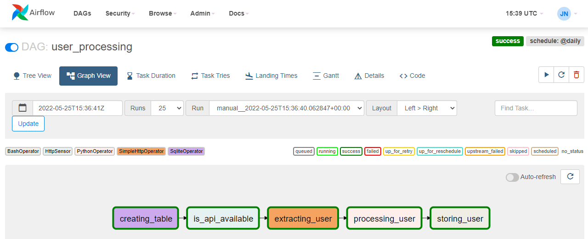

# Airflow DAGs
Repo to store airflow data pipelines (dags)

* airflow version: 2.0.0 
* python version: 3.8

# Setup
```
$ mkdir ~/airflow
$ cd ~/airflow
$ export AIRFLOW_HOME=~/airflow # might include this on ~/.bashrc
$ python -m venv .venv
$ source .venv/bin/activate
$ AIRFLOW_VERSION=2.0.0
$ PYTHON_VERSION=3.8
$ CONSTRAINT_URL="https://raw.githubusercontent.com/apache/airflow/constraints-${AIRFLOW_VERSION}/constraints-${PYTHON_VERSION}.txt"
$ pip install "apache-airflow==${AIRFLOW_VERSION}" --constraint "${CONSTRAINT_URL}"
$ airflow db init
$ airflow users create \
    --username admin \
    --password admin \
    --firstname Peter \
    --lastname Parker \
    --role Admin \
    --email spiderman@superhero.org
$ airflow webserver --port 8080
$ airflow scheduler
```
For more detailed and further instructions on how to setup, go to https://airflow.apache.org/docs/apache-airflow/stable/start/local.html.



